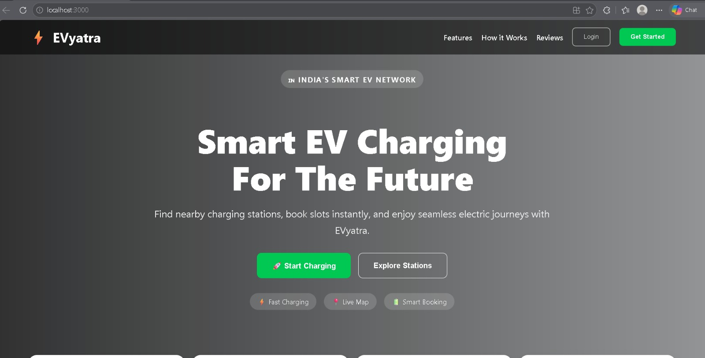
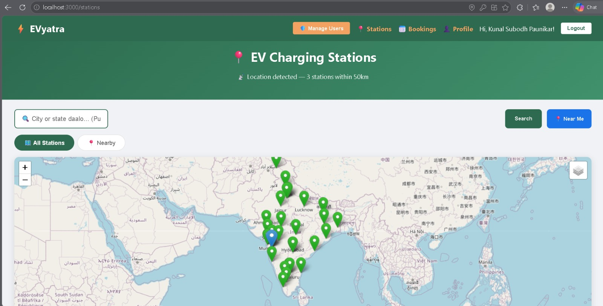
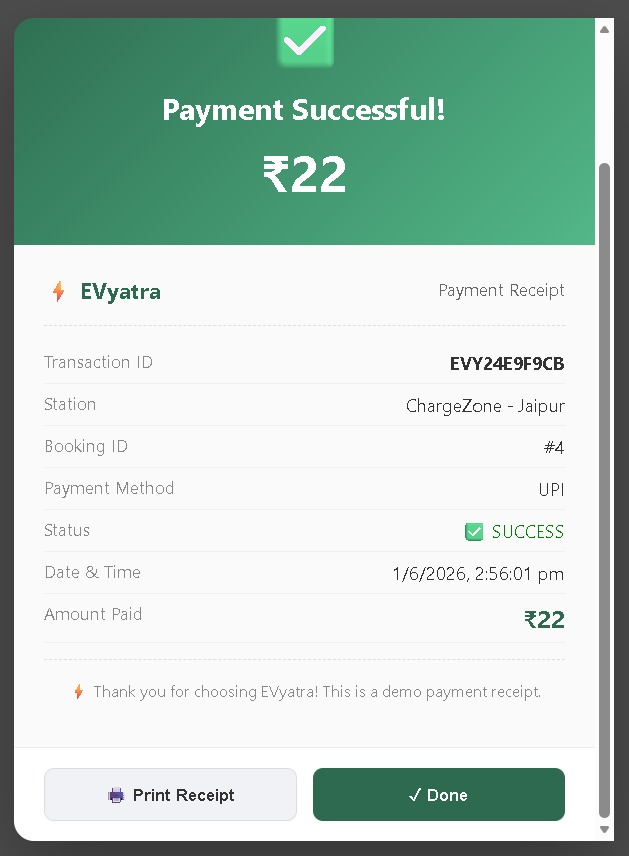
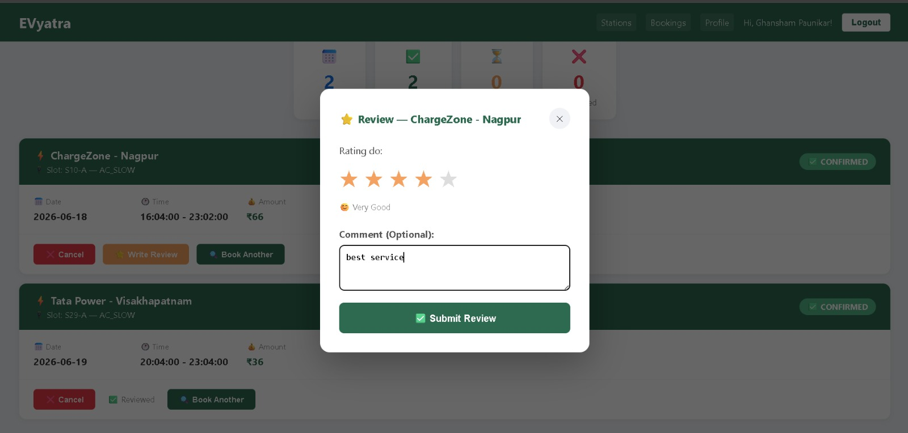

# ⚡ EVyatra — EV Charging Station Booking Platform


## 📌 About Project

**EVyatra** is a full-stack EV Charging Station Booking Platform
built for Electric Vehicle users across India.
Users can find nearby charging stations on a live map,
book slots, and make payments — all in one place.

---

## ✨ Features

### User Features
- 🔐 JWT Authentication (Register/Login/Forgot Password)
- 📧 OTP Email Verification for Password Reset
- 🗺️ Live Map with 30+ Cities (Leaflet Maps)
- 📍 Nearby Station Detection (GPS Location)
- 🗺️ Get Directions — Road Routing
- 🔋 Slot Booking with Date & Time
- 💳 Payment — UPI, Card, NetBanking, Wallet
- 🧾 Payment Receipt with Print Option
- 📅 My Bookings — View & Cancel
- ⭐ Reviews & Ratings — Rate stations after booking
- 👤 My Profile — View & Edit

### Admin Features
- 🛡️ Role Based Access Control
- 👥 Manage Users — View & Delete
- 📍 Manage Stations — Add & Delete
- ⭐ View All Reviews — User feedback monitoring
- 📊 Dashboard — Stats & All Bookings
- 📅 Booking History — All Users

---

## 🛠️ Tech Stack

### Backend
| Technology | Version | Purpose |
|-----------|---------|---------|
| Java | 17 | Core Language |
| Spring Boot | 4.0.6 | Framework |
| Spring Security | 7.0.5 | Authentication |
| JWT (jjwt) | 0.12.3 | Token Auth |
| Hibernate JPA | 7.2 | ORM |
| MySQL | 8.0 | Database |
| JavaMail | - | OTP Email |
| Swagger/OpenAPI | 2.8.8 | API Docs |

### Frontend
| Technology | Purpose |
|-----------|---------|
| React.js | UI Framework |
| Leaflet Maps | Interactive Map |
| Axios | API Calls |
| React Router | Navigation |
| QRCode.react | UPI QR Code |

---

## 📁 Project Structure

```
evyatra/
├── src/main/java/com/evyatra/
│   ├── config/          # Security & CORS Config
│   ├── controller/      # REST API Controllers
│   ├── dto/             # Request/Response DTOs
│   ├── exception/       # Global Exception Handler
│   ├── model/           # JPA Entities
│   ├── repository/      # JPA Repositories
│   ├── security/        # JWT Filter & Util
│   └── service/         # Business Logic
└── src/main/resources/
    └── application.properties
```

---

## 🗄️ Database Schema

```
users          → id, name, email, password, phone, role
ev_stations    → id, name, address, city, lat, lng, chargers, price
charger_slots  → id, station_id, slot_number, charger_type, status
bookings       → id, user_id, slot_id, station_id, date, time, amount
payments       → id, booking_id, amount, method, status, transaction_id
reviews        → id, user_id, station_id, booking_id, rating, comment, created_at
password_reset_otp → id, email, otp, expiry_time
```

---

## 🔐 API Endpoints

### Auth APIs (Public)
```
POST /api/auth/register        → Register
POST /api/auth/login           → Login
POST /api/auth/forgot-password → Send OTP
POST /api/auth/verify-otp      → Verify OTP
POST /api/auth/reset-password  → Reset Password
```

### Station APIs (Public)
```
GET /api/stations              → All Stations
GET /api/stations/search?city= → Search by City
GET /api/stations/{id}         → Station by ID
```

### Booking APIs (Protected)
```
POST /api/bookings             → Create Booking
GET  /api/bookings/my          → My Bookings
PUT  /api/bookings/{id}/cancel → Cancel Booking
```

### Payment APIs (Protected)
```
POST /api/payments/pay         → Process Payment
GET  /api/payments/booking/{id}→ Payment Details
```

### Admin APIs (Admin Only)
```
GET    /api/admin/users        → All Users
DELETE /api/admin/users/{id}   → Delete User
GET    /api/admin/bookings     → All Bookings
POST   /api/admin/stations     → Add Station
DELETE /api/admin/stations/{id}→ Delete Station
GET    /api/admin/stats        → Dashboard Stats
```

### Review APIs (Protected)
```
POST /api/reviews              → Submit Review
GET  /api/reviews/station/{id} → Station Reviews
GET  /api/reviews/check/{id}   → Check if Reviewed
```

---

## ⚙️ Setup & Run Locally

### Prerequisites
- Java 17
- MySQL 8.0
- Maven

### Steps

```bash
# 1. Clone karo
git clone https://github.com/kunalpaunikar/evyatra-backend.git
cd evyatra-backend

# 2. application.properties banao
cp src/main/resources/application-example.properties \
   src/main/resources/application.properties

# 3. MySQL mein database banao
mysql -u root -p
CREATE DATABASE evyatra_db;

# 4. application.properties mein credentials daalo
# DB password, Gmail credentials, JWT secret

# 5. Run karo
mvn spring-boot:run
```

## 📸 Screenshots

### Landing Page


### EV Station View


### Map With Path Direction


### Booking Flow


### Payment Flow


### Admin Dashboard


### Admin Profile


### User Profile


### Reset OTP Mail


### User Review


---
