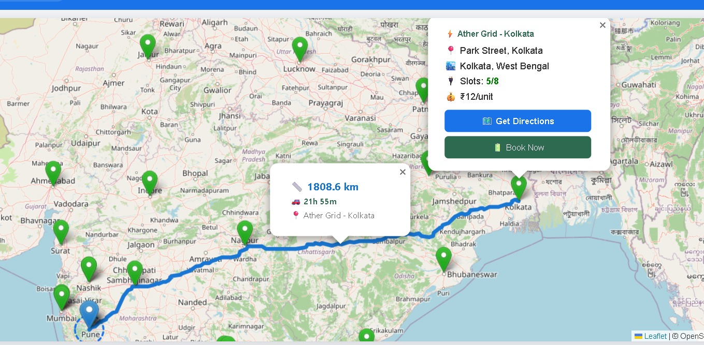
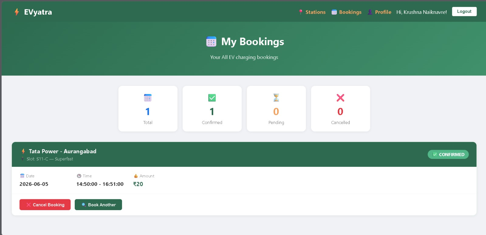
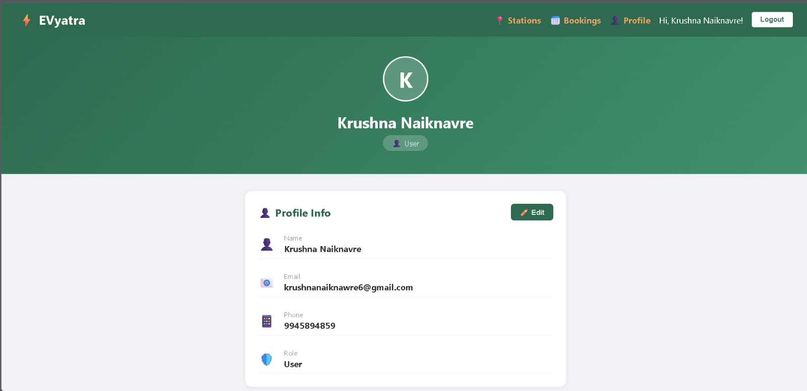
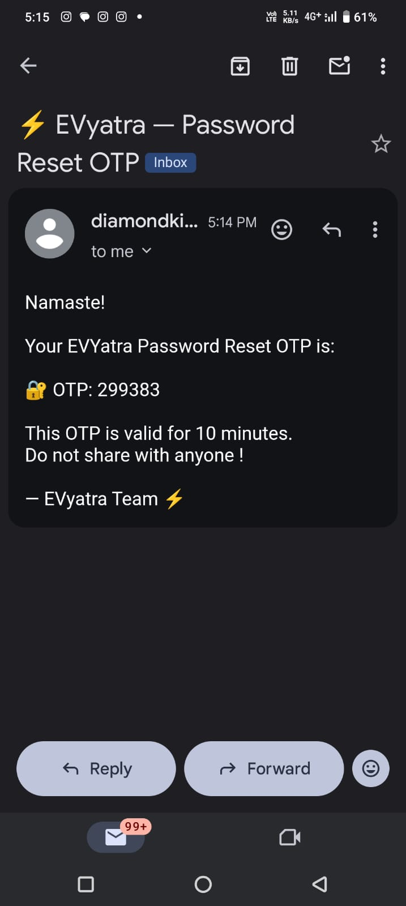
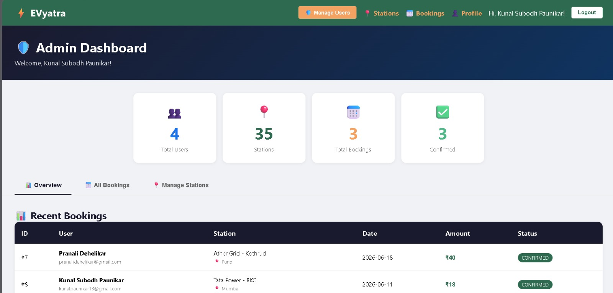
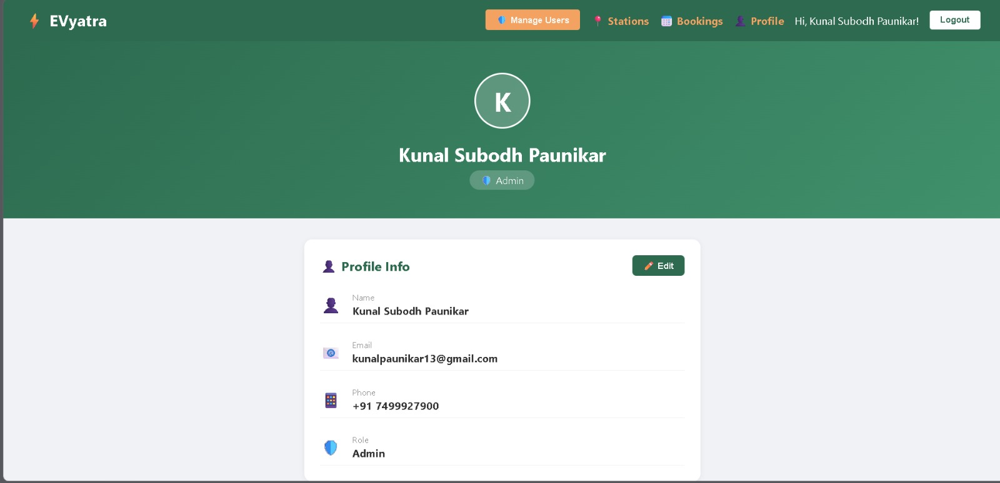

# ⚡ EVyatra — Frontend (React.js)


## 🛠️ Tech Stack
- React.js
- React Leaflet Maps
- Axios
- React Router DOM
- QRCode.react

## ✨ Features

- 🔐 JWT Authentication (Login/Register/Forgot Password)
- 🗺️ Interactive Map with Leaflet (Street/Satellite/Terrain/Dark views)
- 📍 GPS Location + Nearby Stations + Live Routing
- 🔋 Booking Flow — Slot Selection, Date/Time, Payment
- 💳 Payment Gateway UI — UPI QR Code, Card, NetBanking, Wallet
- ⭐ Reviews & Ratings — Star rating system for stations
- 🤖 AI Chatbot — EVyatra Assistant (Powered by Gemini)
- 📱 Fully Responsive Design
- 🛡️ Admin Dashboard — Users, Stations, Bookings, Reviews


## ⚙️ Setup Locally

```bash
git clone https://github.com/kunalpaunikar/evyatra-frontend.git
cd evyatra-frontend
npm install
npm start
```

## 📸 Screenshots

### Landing Page


### EV Stations


### Map with Route Direction


### Booking Flow


### Payment


### User Profile


### Reset OTP Mail


### Admin Dashboard


### Admin Profile


### User Review

